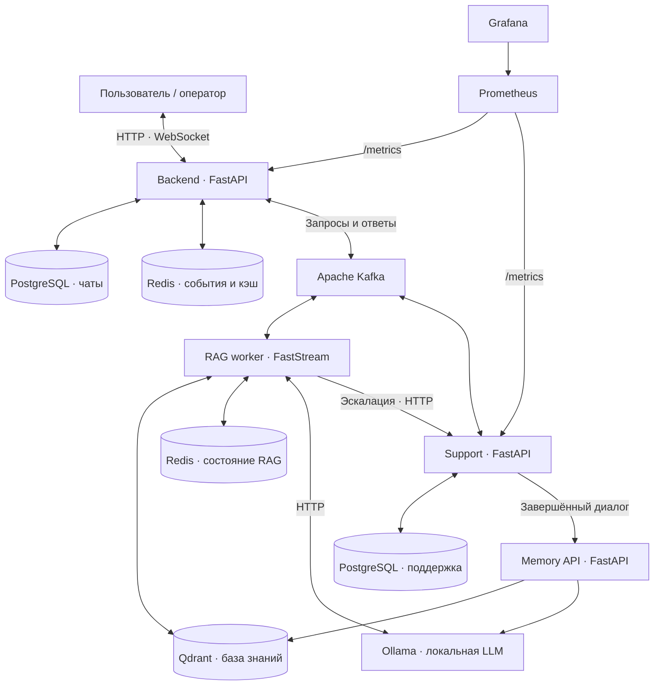

# RLT.Tender Guide

**AI-помощник для поставщиков: от ответа по базе знаний до диалога с оператором.**


[](LICENSE)

Проект для Tender Hack — Нижний Новгород, 2026. Система помогает пользователям Портала поставщиков разбираться в закупках, находить инструкции и решать технические вопросы. Ответы формируются на основе базы знаний; сложные обращения передаются специалистам поддержки.

Этот репозиторий объединяет **микросервисную инфраструктуру** проекта: чат, RAG-движок, операторскую поддержку и мониторинг. Сервисы развиваются в отдельных репозиториях и подключены через Git submodules, а корневой Docker Compose описывает их совместный запуск.

[Возможности](#возможности) · [Архитектура](#архитектура) · [Запуск](#запуск) · [Документация](#документация)

## Возможности

| Возможность | Как реализована |
| --- | --- |
| Диалог в реальном времени | Веб-интерфейс, WebSocket и потоковая доставка ответа |
| Ответы с опорой на источники | RAG-поиск по базе знаний, ссылки на материалы и поддержка медиа в ответах |
| Гибридный поиск | Семантические эмбеддинги RoSBERTa, лексический поиск BM25 и объединение результатов |
| Учёт предметной области | GraphRAG использует связи между категориями закупок для уточнения поиска |
| Пошаговые инструкции | Сценарии с сохранением состояния и переходами между шагами |
| Передача оператору | Эскалация обращения, работа с линиями поддержки и отдельный интерфейс оператора |
| Пополнение знаний | Передача завершённых диалогов поддержки в сервис памяти для обработки и индексации |
| Обратная связь | Реакции на ответы бота и оценки диалогов поддержки |
| Наблюдаемость | HTTP-метрики, темы вопросов, реакции, обращения по линиям и время ответа в Grafana |

## Архитектура



**Путь запроса.** Backend принимает сообщение и отправляет запрос через Kafka. RAG-сервис определяет сценарий обработки, извлекает контекст из Qdrant и обращается к Ollama. События ответа возвращаются через Kafka в backend и далее в браузер. При эскалации к диалогу подключается оператор; завершённый диалог может пополнить базу знаний через Memory API.

### Сервисы и ответственность

| Компонент | Назначение | Технологии |
| --- | --- | --- |
| [`backend`](services/backend) | API, интерфейсы чата и оператора, история, WebSocket, обработка событий | Python, FastAPI, SQLAlchemy, PostgreSQL, Redis |
| [`rag`](services/ml) | Поиск, маршрутизация, пошаговые сценарии, генерация ответов | FastStream, Qdrant, PyTorch, RoSBERTa, BM25, Ollama |
| `memory-api` | Обработка диалогов поддержки и сохранение знаний; использует образ ML-сервиса | FastAPI, Qdrant, Ollama |
| [`support`](services/support) | Операторы, обращения, сообщения и жизненный цикл диалогов поддержки | FastAPI, PostgreSQL, Kafka |
| [`analytics`](services/analytics) | Сбор метрик и готовые дашборды | Prometheus, Grafana |
| `kafka` / `kafka-ui` | Обмен сообщениями и просмотр состояния брокера | Apache Kafka, Kafka UI |

### Почему архитектуру удобно расширять

- **Разделение ответственности.** Чат, ML и поддержка имеют отдельные процессы и контейнеры. Логику одного сервиса можно развивать без переноса остальных в общий код.
- **Событийное взаимодействие.** Kafka отделяет приём сообщений от генерации ответов. Новые обработчики можно подключать к событиям при сохранении совместимости контрактов.
- **Раздельное хранение.** Backend и support используют собственные PostgreSQL; векторные знания находятся в Qdrant.
- **Настраиваемый инференс.** Адрес Ollama и модель задаются окружением. Выбранную модель нужно проверять на качество ответов и совместимость со сценариями.
- **Расширяемая база знаний.** Новые материалы проходят загрузку, разбиение на фрагменты и индексацию. Категории, граф предметной области и сценарии можно дополнять отдельно.
- **Независимые репозитории.** Git submodules фиксируют версии компонентов для общей сборки и позволяют вести разработку сервисов отдельно.

Текущий Compose предназначен для локальной демонстрации: один Kafka-брокер и один RAG worker. Горизонтальное масштабирование потребует отдельной настройки партиций, обработки состояния и метрик нескольких процессов.

## Структура репозитория

```text
.
├── docker-compose.yml       # Общий запуск приложений и инфраструктуры
├── .env.example             # Шаблон настроек
├── .gitmodules              # Репозитории сервисов
├── services/
│   ├── backend/             # API и веб-интерфейсы
│   ├── ml/                  # RAG, Memory API, индексатор и база знаний
│   ├── support/             # Операторская поддержка
│   └── analytics/           # Prometheus и provisioning Grafana
└── LICENSE
```

## Запуск

### 1. Получить проект вместе с сервисами

Нужны Git, Docker с Compose v2 и отдельная Ollama с установленной моделью. Объём RAM, диска и необходимость GPU зависят от выбранной LLM. Контейнер RAG использует CPU PyTorch для эмбеддингов; Ollama запускается вне этого Compose.

```bash
git clone --recurse-submodules https://github.com/todaisy/tender-hack-nizhny-novgorod-2026.git
cd tender-hack-nizhny-novgorod-2026
```

Если репозиторий уже клонирован:

```bash
git submodule update --init --recursive
```

### 2. Подготовить окружение и модели

Создайте `.env` из шаблона, если собственного файла ещё нет:

```bash
cp .env.example .env
```

| Настройка | Что указать |
| --- | --- |
| `KAFKA_CLUSTER_ID` | Валидный идентификатор кластера Kafka |
| `BACKEND_POSTGRES_*`, `SUPPORT_POSTGRES_*` | Имена БД, пользователи и пароли вместо `change_me` |
| `GRAFANA_ADMIN_PASSWORD` | Пароль администратора Grafana |
| `EMBEDDING_MODEL_HOST_PATH` | Абсолютный путь к локальной папке модели `ai-forever/ru-en-RoSBERTa` |
| `OLLAMA_HOST` | Доступный контейнерам адрес Ollama; по умолчанию `http://host.docker.internal:11434` |
| `OLLAMA_MODEL` | Установленная модель; по умолчанию `gpt-oss:20b` |
| `LLM_USER_UUID` | UUID пользователя бота; в шаблоне задано демонстрационное значение |

Для нового Kafka-кластера идентификатор можно получить командой:

```bash
docker run --rm confluentinc/cp-kafka:7.9.0 kafka-storage random-uuid
```

Загрузите выбранную LLM на машине с Ollama, например:

```bash
ollama pull gpt-oss:20b
```

Ollama должна быть запущена и доступна из Docker. Модель RoSBERTa необходимо скачать отдельно: её папка подключается в контейнер только для чтения, автоматического скачивания dense-модели при старте нет. Первичная загрузка зависимостей и sparse-модели BM25 может потребовать доступа к сети.

### 3. Запустить инфраструктуру

Все команды ниже выполняются из корня этого репозитория:

```bash
docker compose config --quiet
docker compose up -d --build
docker compose ps
```

**База знаний индексируется отдельно.** В общей конфигурации задано `AUTO_INDEX_ON_START=false`: запуск контейнеров сам по себе не наполняет Qdrant. Для материалов, подготовленных в ML-сервисе, предусмотрен индексатор:

```bash
docker compose exec rag python -m rag.index_knowledge_base
```

Перед индексацией проверьте наличие исходных данных в `services/ml/dataset/`. Формат данных и этапы подготовки описаны в [документации RAG](services/ml/docs/rag_engine.md) и [пайплайне подготовки](services/ml/docs/parsing_pipeline.md). При добавлении файлов после сборки пересоберите образ ML, поскольку датасет входит в образ.

### 4. Открыть интерфейсы

Адреса при стандартных значениях портов:

| Интерфейс | Адрес |
| --- | --- |
| Чат пользователя | [localhost:8000](http://localhost:8000) |
| Интерфейс оператора | [localhost:8000/static/support_only_frontend.html](http://localhost:8000/static/support_only_frontend.html) |
| Backend Swagger UI | [localhost:8000/docs](http://localhost:8000/docs) |
| Support Swagger UI | [localhost:8067/docs](http://localhost:8067/docs) |
| Memory API Swagger UI | [localhost:8889/docs](http://localhost:8889/docs) |
| Kafka UI | [localhost:8081](http://localhost:8081) |
| Grafana | [localhost:3000/d/rlt-overview](http://localhost:3000/d/rlt-overview) |
| Prometheus targets | [localhost:9090/targets](http://localhost:9090/targets) |

Логин Grafana — `admin`, если не изменён в `.env`. Datasource и дашборд подключаются автоматически. При первом запуске support создаёт демонстрационного оператора, если таблица операторов пуста; это поведение управляется `SUPPORT_DEMO_OPERATOR`.

### Проверка и диагностика

```bash
curl -f http://localhost:8000/api/health
curl -f http://localhost:8000/api/db/ping
curl -f http://localhost:8000/api/redis/ping
docker compose logs --tail=100 backend rag memory-api support
```

Эти проверки помогают оценить доступность backend и его зависимостей. Для сквозной проверки отправьте вопрос в чате, проверьте ответ с источниками, переход к оператору и появление метрик в Grafana.

Остановка с сохранением именованных томов:

```bash
docker compose down
```

## Наблюдаемость

Prometheus собирает метрики backend и support, а Grafana отображает технические и продуктовые показатели:

- доступность сервисов, интенсивность HTTP-запросов и долю ошибок;
- тематику вопросов и реакции на ответы бота;
- количество обращений по линиям L1 / L2 / L3;
- время первого ответа, длительность закрытых диалогов и оценки пользователей.

В текущем `prometheus.yml` одновременно перечислены адреса через хост и через Docker DNS. При адаптации конфигурации оставьте по одному доступному адресу каждого экземпляра, чтобы избежать двойного сбора. Подробнее о типах метрик и ограничениях агрегации — в [документации аналитики](services/analytics/README.md).

## Текущий статус и развитие

Проект — хакатонный прототип с интегрированной микросервисной инфраструктурой. Текущая конфигурация рассчитана на локальный запуск и демонстрацию. Сборка контейнеров требует предварительной подготовки моделей и данных; результаты отдельных ML-тестов не являются SLA всей системы.

Дальнейшие направления развития:

- автоматизированная сквозная проверка сценария «пользователь → RAG → оператор»;
- CI для общей сборки и совместимости версий сервисов;
- централизованная аутентификация, разграничение доступа и TLS для публичного развёртывания;
- трассировка запросов между сервисами и оповещения о сбоях;
- проверка работы под нагрузкой и настройка масштабирования.

## Документация

- [Общая конфигурация инфраструктуры](docker-compose.yml)
- [Настройки окружения](.env.example)
- [Запуск ML-сервиса и подготовка моделей](services/ml/docs/docker_run.md)
- [RAG-движок и индексация](services/ml/docs/rag_engine.md)
- [Обмен RAG-сервиса через Kafka](services/ml/docs/rag_kafka.md)
- [Пополнение знаний из диалогов](services/ml/docs/dialog-knowledge.md)
- [Метрики backend](services/backend/docs/metrics.md) и [поддержки](services/support/docs/metrics.md)
- [Дашборды и мониторинг](services/analytics/README.md)

Документация отдельных сервисов также описывает их самостоятельный запуск. Для совместного запуска используйте корневой `docker-compose.yml` и инструкцию выше.

## Компоненты и авторство

Проект объединяет командные разработки. Исходные репозитории компонентов:

| Компонент | Репозиторий |
| --- | --- |
| Backend | [Gospoduu/AlphaRAG.hack](https://github.com/Gospoduu/AlphaRAG.hack) |
| ML / MAESTRO | [ardont/MAESTRO](https://github.com/ardont/MAESTRO) |
| Support | [Gospoduu/support_service](https://github.com/Gospoduu/support_service) |
| Analytics | [todaisy/RLT_analytics](https://github.com/todaisy/RLT_analytics) |

## Лицензия

В корневом репозитории размещена [MIT License](LICENSE). Подключённые сервисы, зависимости, модели и материалы базы знаний имеют собственные условия использования; корневая лицензия не заменяет их лицензии и уведомления об авторстве.
